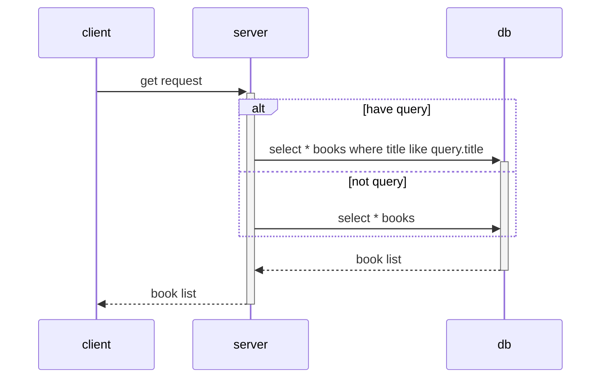
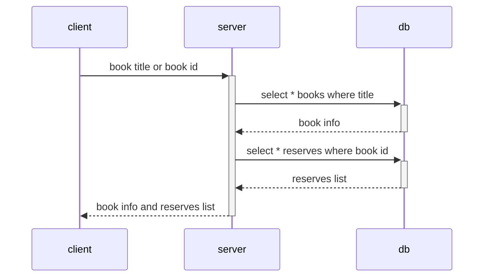
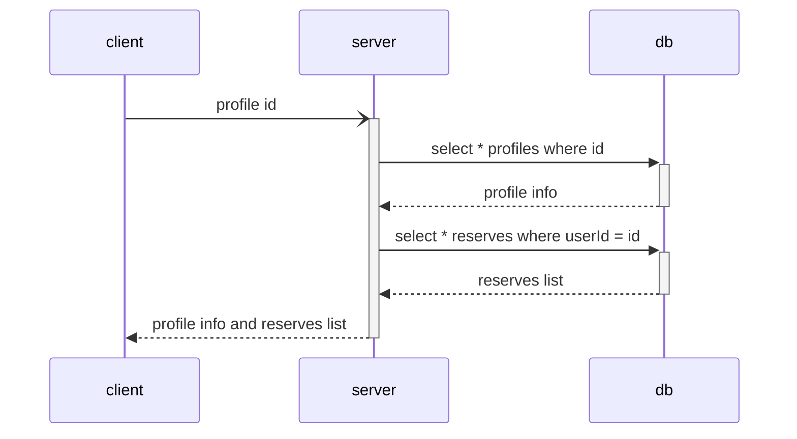
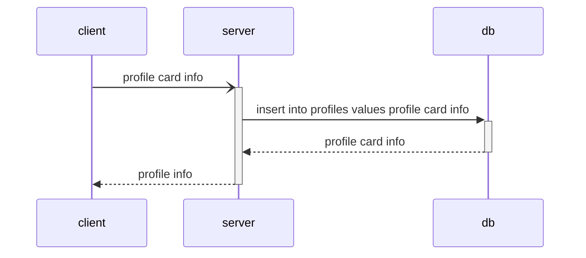
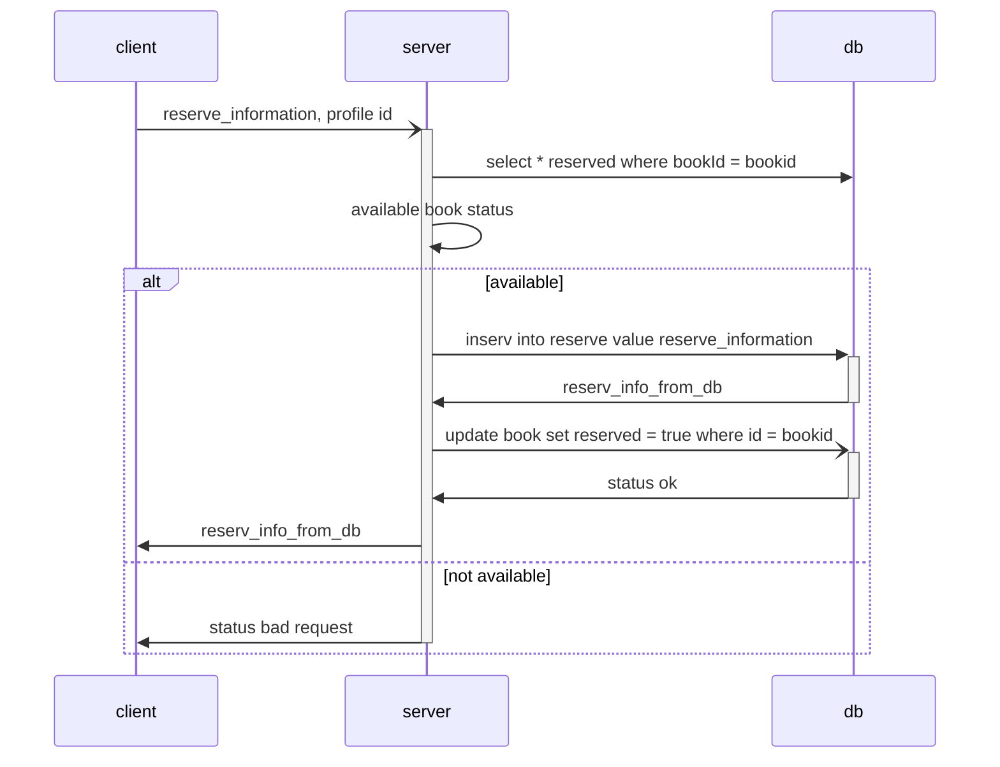
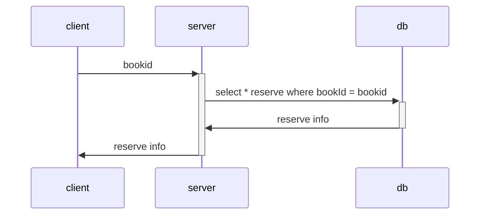
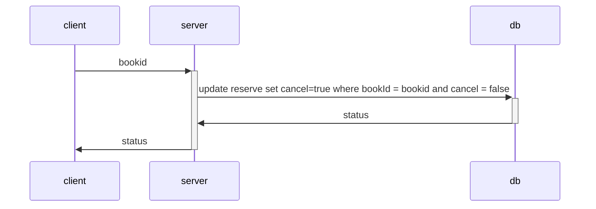
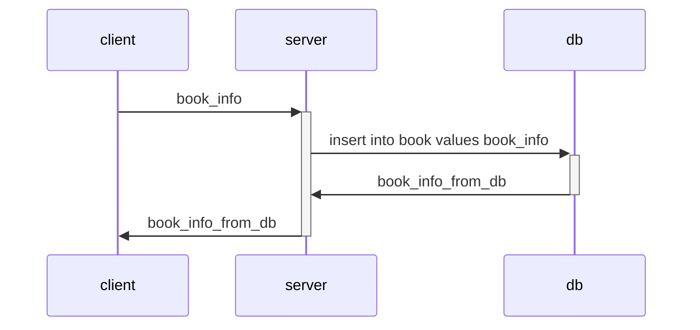
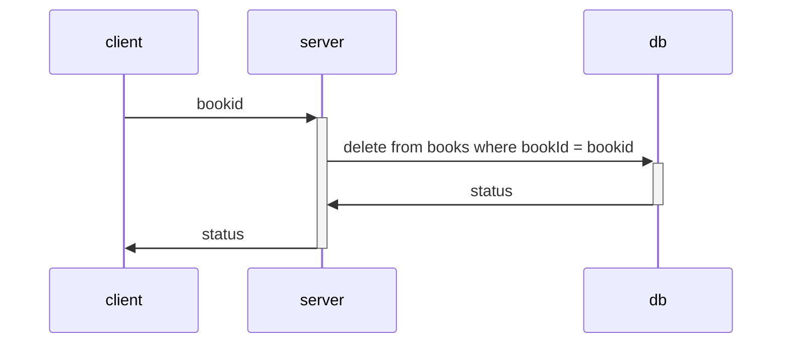

## interfaces

```typescript
interface IBook {
	id: number
	title: string
	author: string
	description: string
	reserved: 
}

interface IReserve {
	id: number
	profileCard: hasOne(IProfileCard)
	book: hasOne(IProfileCard)
	timeout: datetime
	closed: boolean
}

interface IProfileCard {
	id: number
	email: string
	phone: string
	books: hasMany(IReserv)
}
```

## sequinse diagrams

### get book list


### get book info


### get profileCard


### create profileCard


### reserve book


### get reserve info


### cancel reserve


### create new book


### delete book
