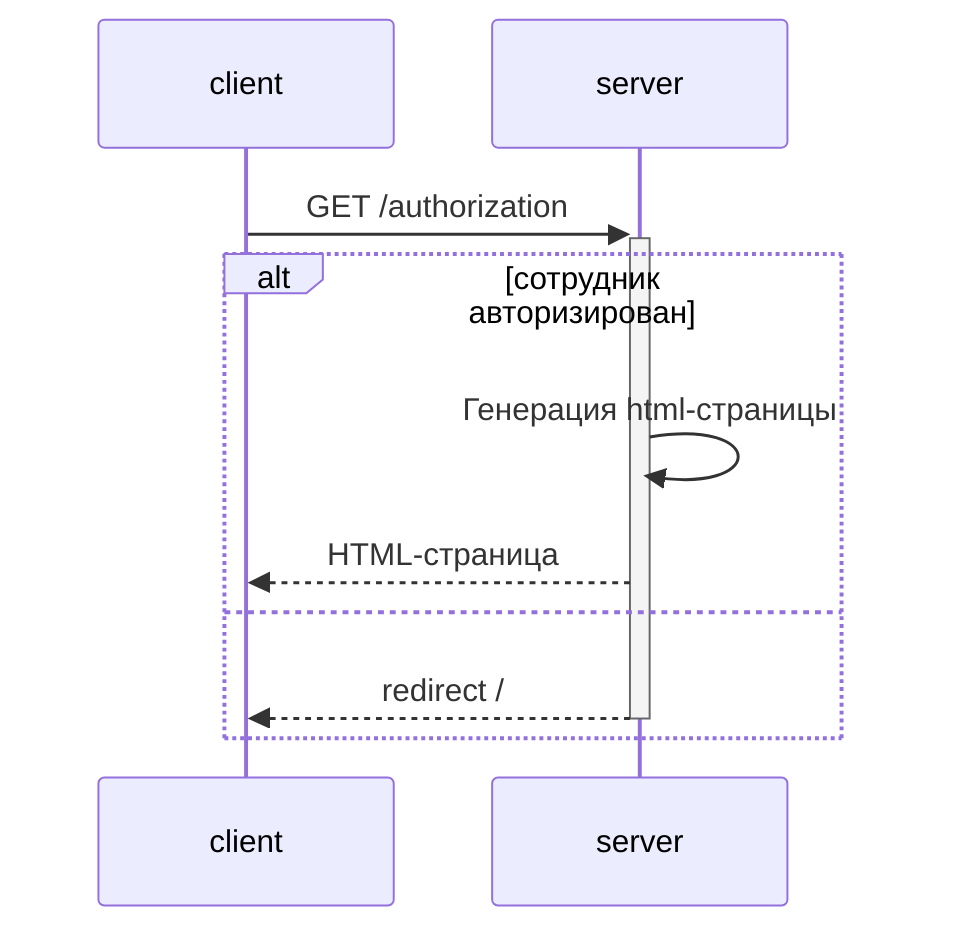

# Authoriztion.get.index

```mermaid
sequenceDiagram;
	participant client
	participant server
  client->>+server: GET /authorization
  alt сотрудник авторизирован
    server->>server: Генерация html-страницы
    server-->>client: HTML-страница
  else
    server-->>-client: redirect /
  end
```

[diagrams](../Diagrams.md)