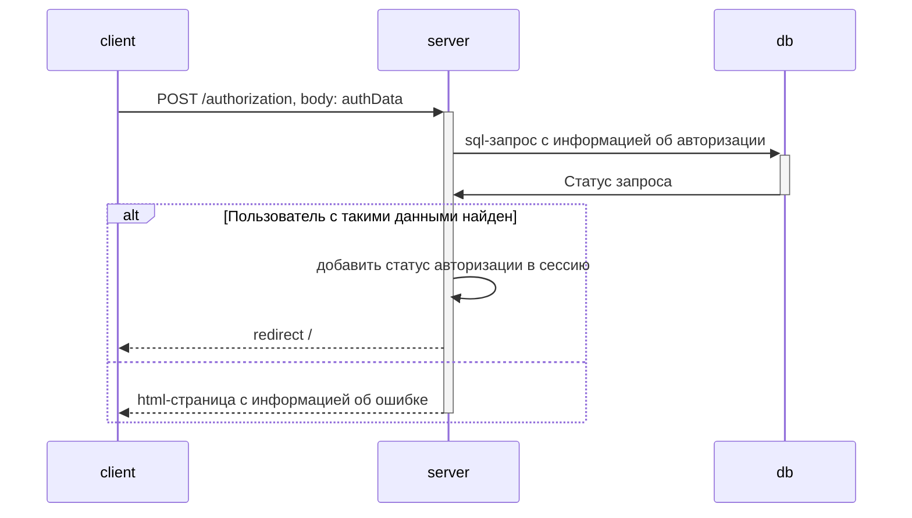

## authorization.post.index

```mermaid
sequenceDiagram;
	participant client
	participant server
	participant db
  client->>+server: POST /authorization, body: authData
  server->>+db: sql-запрос с информацией об авторизации
  db->>-server: Статус запроса
  alt Пользователь с такими данными найден
    server->>server: добавить статус авторизации в сессию
    server-->>client: redirect /
  else
    server-->>-client: html-страница с информацией об ошибке
  end
```

[diagrams](../Diagrams.md)