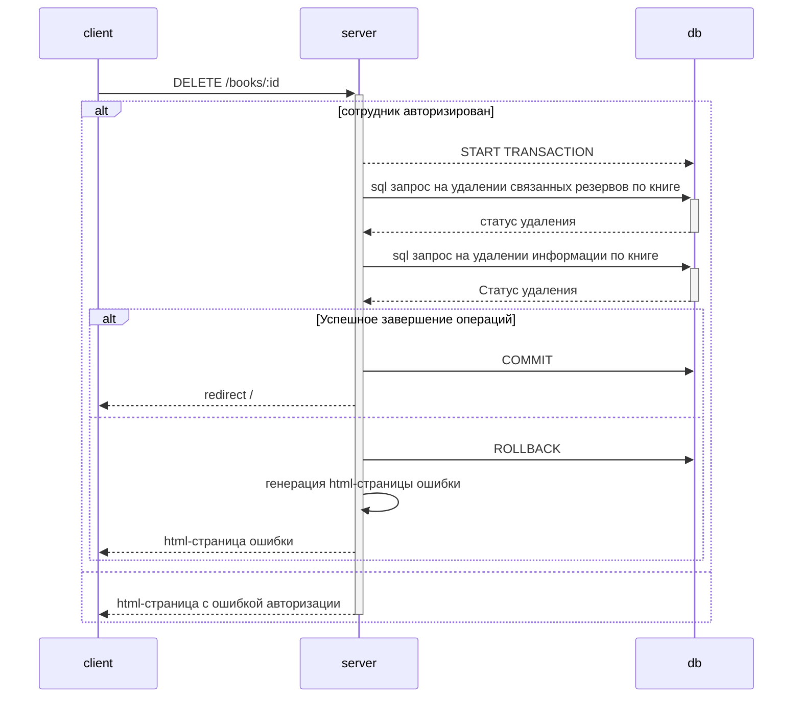

# delete book

```mermaid
sequenceDiagram;
	participant client
	participant server
	participant db
  client->>+server: DELETE /books/:id
  alt сотрудник авторизирован
    server-->>db: START TRANSACTION
    server->>+db: sql запрос на удалении связанных резервов по книге
    db-->>-server: статус удаления
    server->>+db: sql запрос на удалении информации по книге
    db-->>-server: Статус удаления
    alt Успешное завершение операций
      server->>db: COMMIT
      server-->>client: redirect /
    else
      server->>db: ROLLBACK
      server->>server: генерация html-страницы ошибки  
      server-->>client: html-страница ошибки
    end
  else
    server-->>-client: html-страница с ошибкой авторизации
  end
```

[Diagrams](../Diagrams.md)