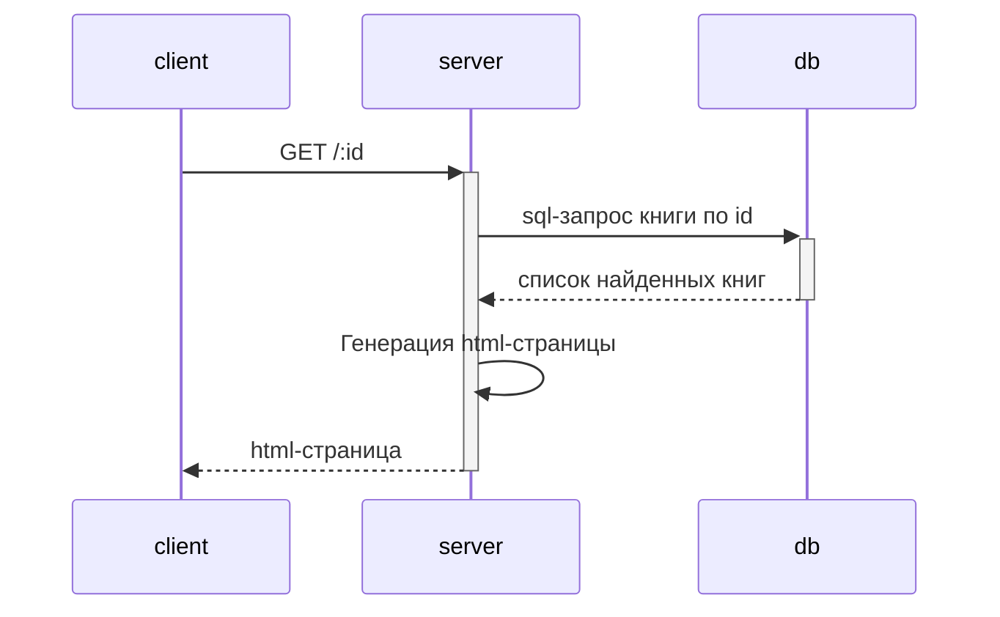

# showBook

```mermaid
sequenceDiagram;
	participant client
	participant server
	participant db
	client->>+server: GET /:id
  server->>+db: sql-запрос книги по id
  db-->>-server: список найденных книг
  server->>server: Генерация html-страницы
  server-->>-client: html-страница
```

[Diagrams](../Diagrams.md)