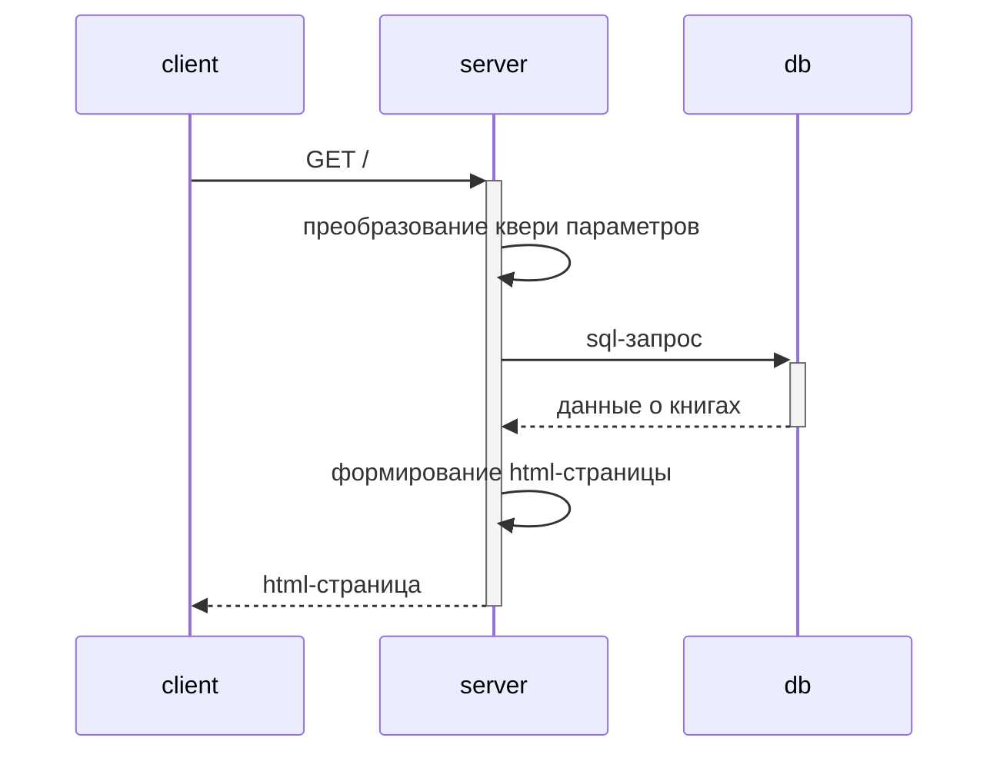

### home route /

```mermaid
sequenceDiagram;
  participant client
	participant server
	participant db
  client->>+server: GET /
  server->>server: преобразование квери параметров
  server->>+db: sql-запрос
  db-->>-server: данные о книгах
  server->>server: формирование html-страницы
  server-->>-client: html-страница
```

[Diagrams](../Diagrams.md)