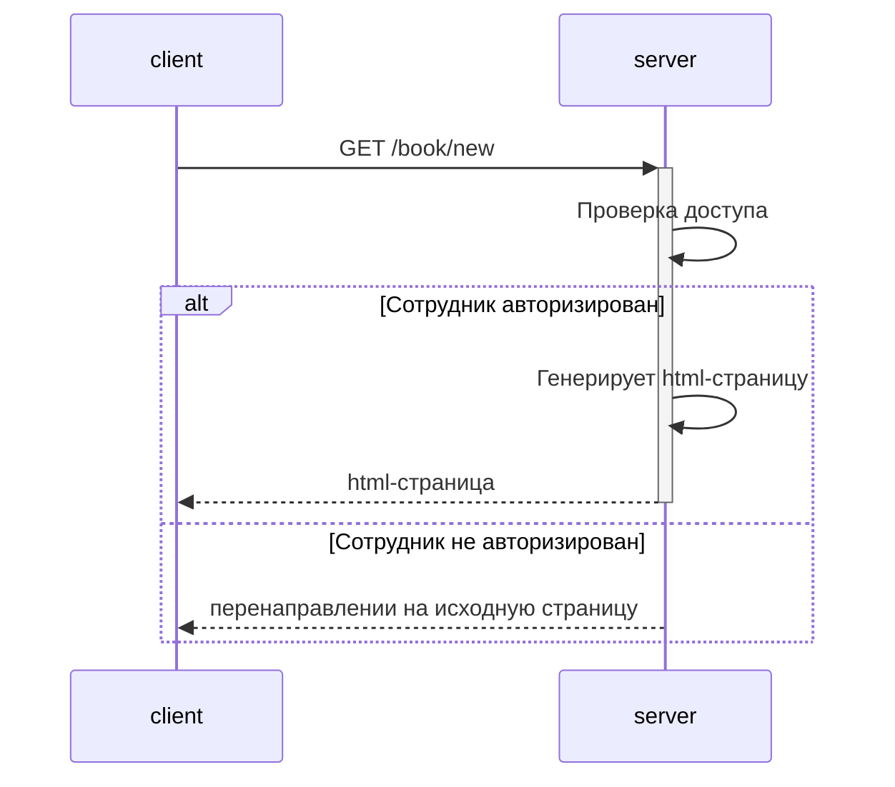

# Book.get.new

```mermaid
sequenceDiagram;
	participant client
	participant server
	client->>+server: GET /book/new
	server->>server: Проверка доступа
	alt Сотрудник авторизирован
	server->>server: Генерирует html-страницу
	server-->>-client: html-страница
	else Сотрудник не авторизирован
	server-->>client: перенаправлении на исходную страницу
	end
```

[Diagrams](../Diagrams.md)