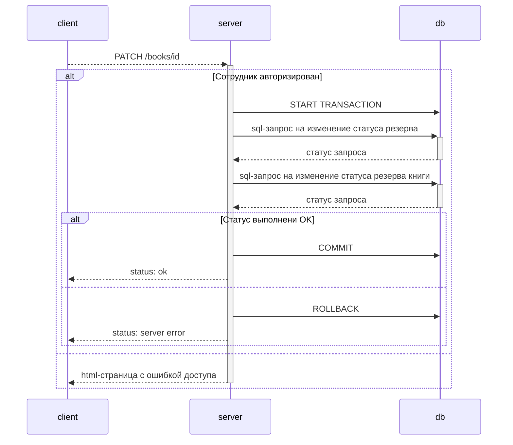

# Book.patch.id

```mermaid
sequenceDiagram;
  participant client
	participant server
	participant db
  client-->>+server: PATCH /books/id
  alt Сотрудник авторизирован
  server->>db: START TRANSACTION
  server->>+db: sql-запрос на изменение статуса резерва
  db-->>-server: статус запроса
  server->>+db: sql-запрос на изменение статуса резерва книги
  db-->>-server: статус запроса
  alt Статус выполнени OK
    server->>db: COMMIT
    server-->>client: status: ok
  else
    server->>db: ROLLBACK
    server-->>client: status: server error
  end
  else
    server-->>-client: html-страница с ошибкой доступа
  end
```

[diagrams](../Diagrams.md)