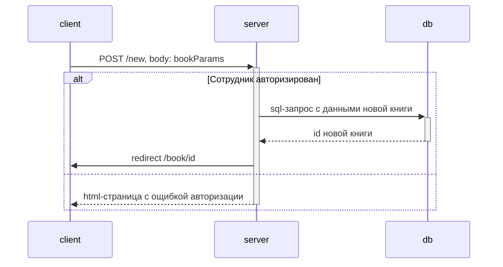

```mermaid
sequenceDiagram;
	participant client
	participant server
	participant db
  client->>+server: POST /new, body: bookParams
  alt Сотрудник авторизирован
    server->>+db: sql-запрос с данными новой книги
    db-->>-server: id новой книги
    server->>client: redirect /book/id
  else
    server-->>-client: html-страница с ощибкой авторизации
  end
```

[Diagrams](../Diagrams.md)
