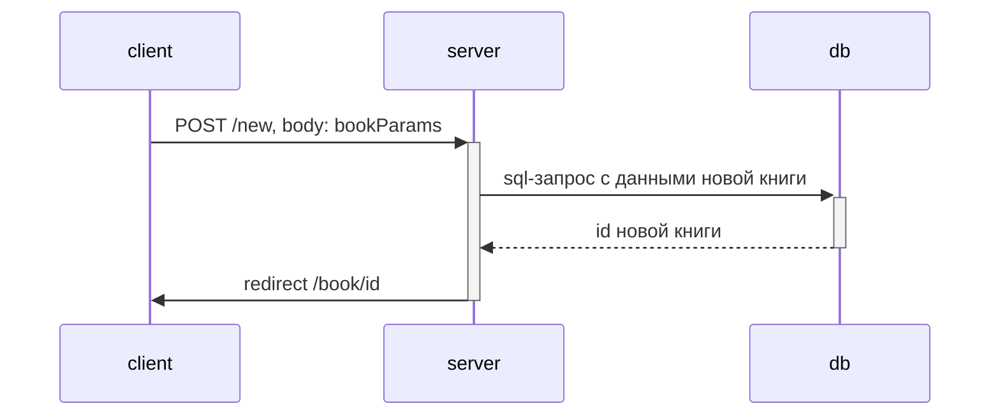

```mermaid
sequenceDiagram;
	participant client
	participant server
	participant db
  client->>+server: POST /new, body: bookParams
  server->>+db: sql-запрос с данными новой книги
  db-->>-server: id новой книги
  server->>-client: redirect /book/id
```

[Diagrams](../Diagrams.md)
