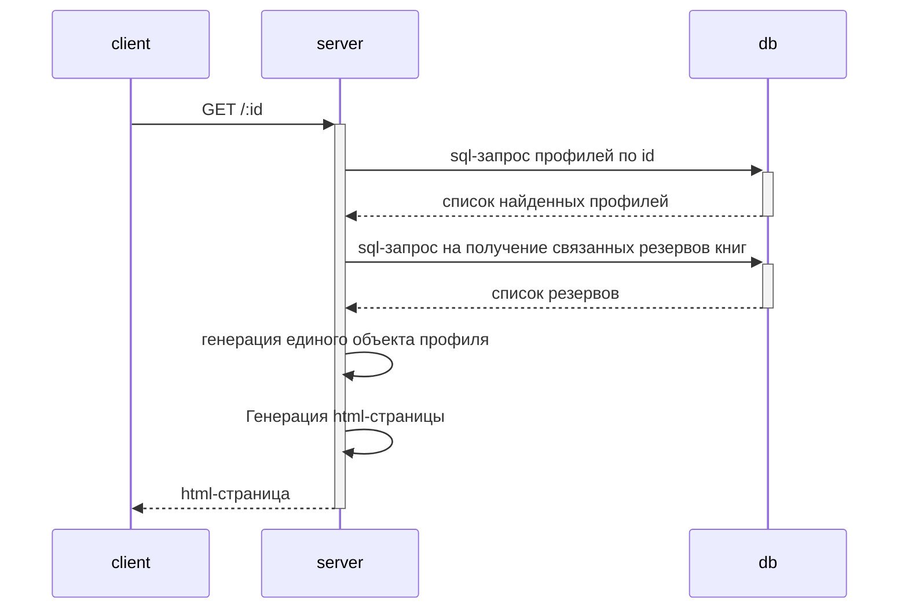

# Profiles.get.id

```mermaid
sequenceDiagram;
	participant client
	participant server
	participant db
	client->>+server: GET /:id
  server->>+db: sql-запрос профилей по id
  db-->>-server: список найденных профилей
  server->>+db: sql-запрос на получение связанных резервов книг
  db-->>-server: список резервов
  server->>server: генерация единого объекта профиля
  server->>server: Генерация html-страницы
  server-->>-client: html-страница
```

[Diagrams](../Diagrams.md)