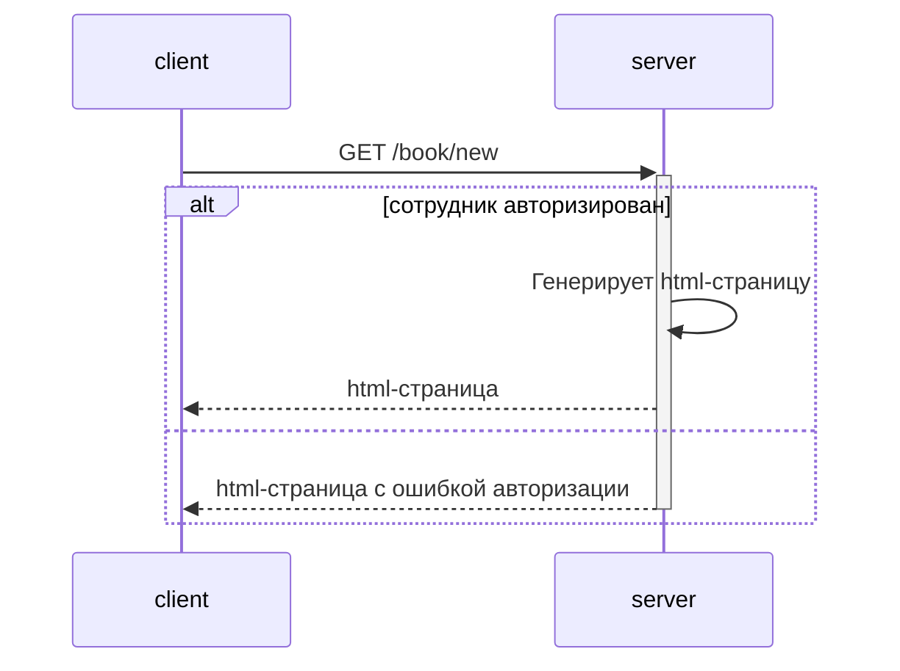

# Profiles.get.new

```mermaid
sequenceDiagram;
	participant client
	participant server
	client->>+server: GET /book/new
  alt сотрудник авторизирован
		server->>server: Генерирует html-страницу
		server-->>client: html-страница
  else
    server-->>-client: html-страница с ошибкой авторизации
  end

```

[Diagrams](../Diagrams.md)