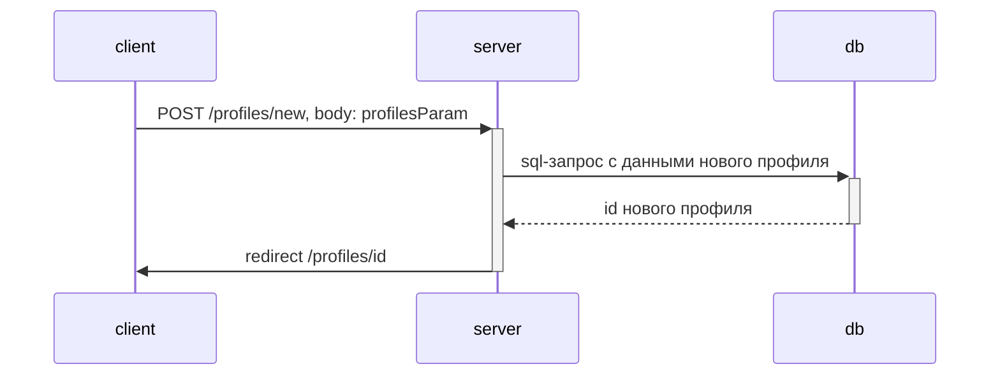

# Profiles.post.new

```mermaid
sequenceDiagram;
	participant client
	participant server
	participant db
  client->>+server: POST /profiles/new, body: profilesParam
  server->>+db: sql-запрос с данными нового профиля
  db-->>-server: id нового профиля
  server->>-client: redirect /profiles/id
```

[Diagrams](../Diagrams.md)