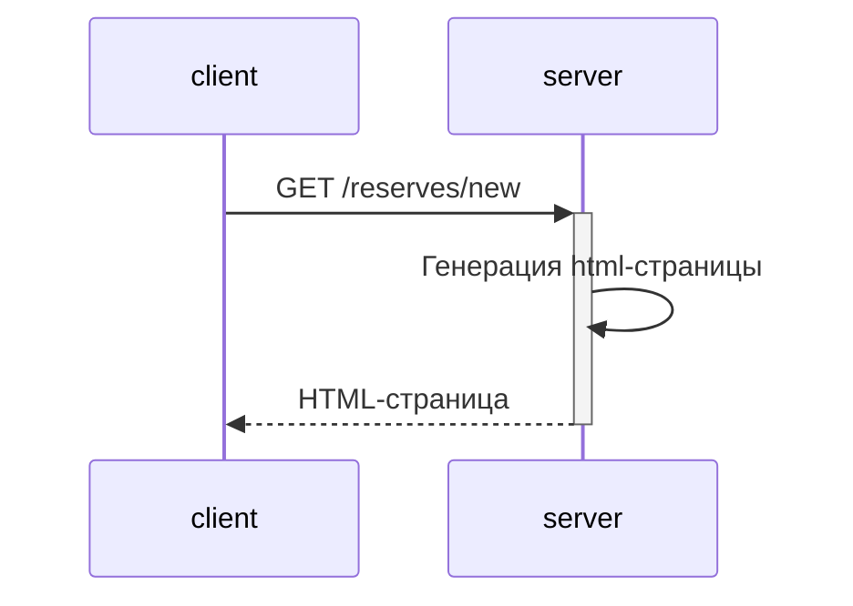

# Reserves.get.new

```mermaid
sequenceDiagram;
	participant client
	participant server
  client->>+server: GET /reserves/new
  server->>server: Генерация html-страницы
  server-->>-client: HTML-страница
```

[diagrams](../Diagrams.md)